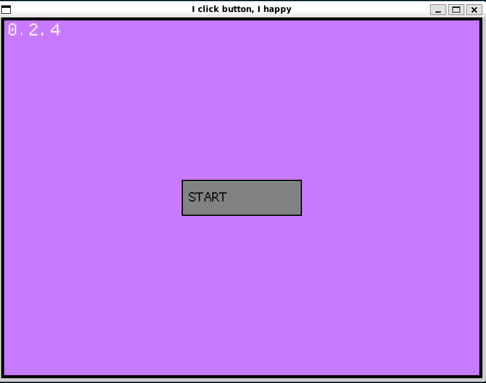

# simple-menu



[](https://opensource.org/licenses/MIT)
[](https://www.rust-lang.org/)

> "I click button, I happy."

A ridiculously over-engineered, lightweight menu playground and bouncing dot simulator written in Rust with Macroquad.

It kind of looks like 2001 in a nutshell, but now with clap CLI arguments and release profile optimizations that treat 20 bouncing circles like a AAA physics engine.

---

## What is this?

Calling it a "game" is definitely a stretch, but it has three screens and buttons you can click:

- **Main Menu**: Shows the version and a big START button. When you click it, it prints `game started!` to stdout and throws you into the action.
- **Game Prototype**: A gray box with "Cute Dots" bouncing around inside. If 20 dots aren't enough, smash the **dots +** button to spawn more.
- **Settings**: A placeholder paradise where you can cycle the background through Purple, Red, Green, Blue, and Pink, or toggle Developer Mode.

---

## Over-Engineered Improvements

Recently forked and given far more engineering discipline than a dot simulator probably deserves:

- **Clap CLI integration**: You can now pass `--dev-mode` directly from your terminal to launch straight into the developer HUD.
- **Aggressive compiler optimizations**: Configured `Cargo.toml` with `opt-level = 3`, `lto = "fat"`, `codegen-units = 1`, `panic = "abort"`, and `strip = true`. Because 20 bouncing dots deserve bare-metal performance.
- **Modular crate split**: Decoupled `src/lib.rs` from `src/main.rs`. Now `CurrentState`, `BgColor`, and `CuteDot` live in their own library crate.
- **Developer HUD**: Displays live mouse coordinates `(x, y)`, total dot count, and an FPS counter that updates every 10 frames to avoid burning out your screen.

---

## Running It

Make sure you have Rust installed.

```bash
# Clone the repository
git clone https://github.com/Jacob-Dayan/simple-menu.git
cd simple-menu

# Run it
cargo run
```

### CLI Options

Thanks to `clap`, there are actual command-line flags:

```bash
# Launch directly with the developer overlay active
cargo run -- --dev-mode

# Print version
cargo run -- --version

# Print help
cargo run -- --help
```

---

## How to "Play"

| Screen | Buttons | What happens |
| :--- | :--- | :--- |
| Main Menu | **START** | Takes you to the simulation. |
| Game | **dots +** | Spawns another dot. |
| Game | **Settings** | Opens the settings. |
| Settings | **Choose color** | Cycles background color. |
| Settings | **Dev: true/false** | Toggles the HUD showing FPS and mouse coordinates. |
| Settings | **Back to game** | Takes you back to the bouncing dots. |

---

## Tech Stack

- **Rust** (2024 edition)
- **Macroquad** (for rendering windows, rectangles, and circles)
- **Clap** (for parsing two CLI flags with maximum type safety)

---

## License

MIT. Do whatever you want with it.
